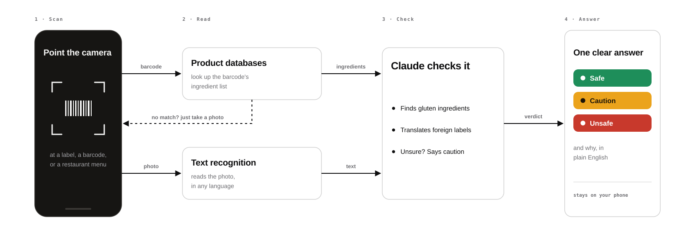

# GlutenOrNot

GlutenOrNot instantly checks if packaged foods are safe for people with celiac disease. Point your camera at an barcode, ingredient label or restaurant menu and get a clear verdict in seconds.

The app is free and requires no account creation to use. Here is a [quick walkthrough of GlutenOrNot](https://www.youtube.com/watch?v=g6qqkZzcHJE) as it works in Sept. 2026, scanning barcodes, ingredient labels and a restaurant menu.

We built this because we have celiac disease ourselves. Figuring out what we could and couldn't eat was confusing at first, and we didn't want to pay for an app just to scan ingredients. We hope this makes it a little easier for you too. If you want to run locally or make your own version, just add your own API credentials (or modify as you see fit). 

## Features

- **Photo scanning**: Take a photo of any ingredient label or restaurant menu
- **Barcode scanning**: Point at a product barcode for instant lookup via Open Food Facts, USDA, and UPCitemdb
- **Desktop support**: Drag-drop images or paste from clipboard
- **AI-powered analysis**: Uses OCR + Claude to identify gluten-containing ingredients
- **Clear verdicts**: Safe, Caution, or Unsafe with explanations
- **Flashlight assist**: torch toggle on the camera, and one-tap "turn on flashlight & retry" when a label can't be read (iOS)
- **Honest on weak signal**: shows the photo uploading with a percentage and says when a slow connection is the wait, instead of asking you to start over (iOS 1.4.3+)
- **Barcode dead ends are a doorway, not a verdict**: when a barcode isn't in the databases or has no ingredient data, the app says so and opens a photo-only camera for the label instead of guessing (iOS 1.5.0+)
- **Scan history**: Recent scans saved on-device (iOS) — no account, clearable anytime
- **Multilingual**: Analyzes labels and menus in any language (dedicated Spanish, Dutch, Catalan, and French support)
- **Offline support**: Works as a PWA with offline fallback
- **Privacy-focused**: No accounts required, no images stored
- **Mobile app**: iOS app via React Native/Expo

## Getting Started

### Web App

```bash
npm install
cp .env.example .env   # Add your API keys
npx vercel login       # One-time auth
npx vercel dev         # http://localhost:3000
```

Note: `vercel dev` runs the serverless functions locally. For static-only serving (no API), use `npm run dev:static`.

### Mobile App (iOS)

The app uses native modules (camera, SVG, Sentry), so it needs a **development build** — Expo Go can't run it.

```bash
cd mobile
npm install
npx expo run:ios            # builds + runs a dev build in the iOS Simulator
# npx expo run:ios --device # run on a physical device (needed for the live camera)
```

Requires Xcode. For producing a release build + App Store submission, see [`mobile/RELEASE.md`](./mobile/RELEASE.md).

Scanning requires:
- `GOOGLE_CLOUD_VISION_API_KEY`
- `ANTHROPIC_API_KEY`

## Project Structure

```
glutenornot.com/
├── web/                    # Web PWA
│   ├── index.html          # Single-page app (all UI states)
│   ├── css/styles.css      # Mobile-first styles
│   ├── js/
│   │   ├── app.js          # Main orchestration
│   │   ├── camera.js       # Photo capture, drag-drop, paste
│   │   ├── api.js          # API client
│   │   └── ui.js           # UI state transitions
│   └── tests/              # Vitest tests
├── mobile/                 # React Native (Expo) iOS app
│   ├── app/                # Expo Router screens
│   ├── components/         # Reusable components
│   ├── services/           # API client
│   └── constants/          # Shared constants
├── api/                    # Shared Vercel serverless functions
│   ├── _utils.js           # Shared rate limiting, verdict normalization, constants
│   ├── _analytics.js       # PostHog scan-event logging (no-op until POSTHOG_API_KEY set)
│   ├── analyze.js          # Serverless: OCR + Claude analysis
│   ├── barcode.js          # Barcode lookup (waterfall: Open Food Facts → USDA → Nutritionix → UPCitemdb)
│   ├── track.js            # Client failure beacon (timeout/network/cancelled/interrupted scan_failed)
│   ├── recovery.js         # Barcode-recovery funnel beacon (barcode_recovery: flow_id + reason + stage, content-free)
│   └── health.js           # Health check
└── package.json            # Monorepo root
```

## How It Works



The engineering version, with the lookup waterfall, the prompt rules and the safe-verdict floor, is [`docs/how-it-works.svg`](docs/how-it-works.svg).

**Photo scanning:**
1. User provides image (camera, upload, drag-drop, or paste)
2. Image is resized and sent to `/api/analyze`
3. Google Cloud Vision extracts text via OCR
4. Claude analyzes ingredients or menu items and returns verdict. Every "caution" names one specific reason (oats, a may-contain warning, a label conflict, an ingredient whose source the maker needn't declare, or an unreadable label); natural flavors, maltodextrin, spices and other ingredients labeling law already covers are not a reason on their own. An explicit gluten-free claim on the label ("gluten-free", "sin gluten", "glutenvrij", a GFCO mark…) is treated as the regulated claim it is (<20 ppm) and covers oats and those undeclared-source ingredients; a listed gluten source and "may contain" advisories still win
5. Verdicts are floored to "caution" when OCR extracted almost no text, or when a label's ingredient list looks cut off (no "Ingredients:" heading, or nothing marking its end) — "safe" requires a whole list to justify it
6. UI displays result: Safe / Caution / Unsafe

**Barcode scanning (mobile):**
1. Camera auto-detects barcodes (EAN-13, EAN-8, UPC-A, UPC-E)
2. Barcode is sent to `/api/barcode`
3. Product looked up via waterfall: Open Food Facts → USDA → Nutritionix (paid key only) → UPCitemdb (keyless)
4. Claude analyzes the retrieved ingredients and returns verdict. With the fast path on (`JEV_MODE`, decision 007), TypeSafe's Jev reads an Open Food Facts ingredient list in parallel: when Jev and a code rule agree on a clear "unsafe" (and, in the final stage, a clear "safe"), that answer comes back in about 0.2 s and Claude's verdict is recorded as its audit
5. If the product isn't found, or is found without ingredient/allergen data (the response is marked `result_reason: "missing_context"`), the iOS app shows a neutral "we can't tell" state instead of a verdict and offers a photo-only capture of the ingredient label, which then goes through the photo path above

## Deployment

### Web (Vercel)

1. Connect repo to Vercel
2. Add environment variables
3. Deploy

### Mobile (App Store)

The proven release path is a **local Xcode archive** — see [`mobile/RELEASE.md`](./mobile/RELEASE.md)
for the full step-by-step (version bump → prebuild → archive → upload → submit).

EAS is an alternative, not required:

```bash
cd mobile
npx eas-cli login
npx eas-cli build --platform ios --profile preview
npx eas-cli submit --platform ios
```

## Testing

Run tests:

```bash
npm test              # Run all tests once
npm run test:watch    # Run in watch mode
npm run test:coverage # Run with coverage report
```

Tests cover:
- Claude response parsing and fallback behavior
- Safety floor on low-text OCR reads, and the cut-off ingredient-list gate
- The gluten-free label-claim rule (prompt text + claim detection), plus a live eval against the real prompt and model — `web/tests/api/evals/`, opt-in with `RUN_LIVE_EVALS=1` and an `ANTHROPIC_API_KEY`, ~86 calls per run
- Analytics event properties (app version, model, capture metrics, label-claim presence)
- The barcode missing-context marker and the recovery funnel endpoint (allowlist, size cap, rate cap, no product content)
- Rate limiting logic
- API error handling

## Known Limitations

- **Rate limiting**: In-memory storage won't persist across serverless instances. Migrate to Vercel KV for production.

## Contributing

See [`ROADMAP.md`](./ROADMAP.md) for the prioritized improvement plan.

Guidelines: Keep it simple, test on mobile, be conservative with verdicts (every "caution" names a specific reason, and nothing is "safe" on a guess — decision 006).

## License

MIT
